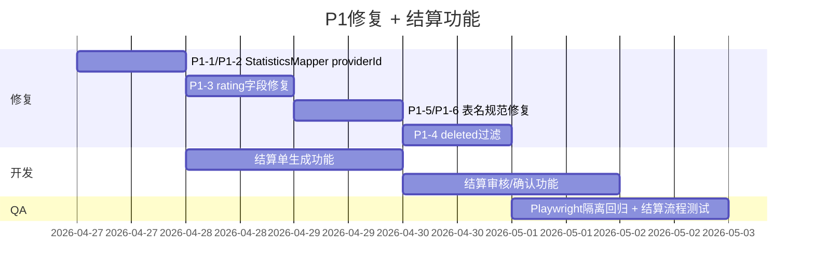
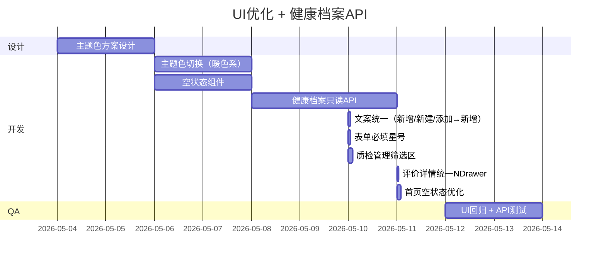
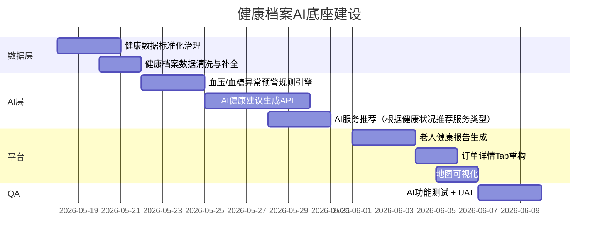

# 改进路线图（修订版）— 智慧居家养老服务管理平台

> 生成日期：2026-04-26  
> 修订日期：2026-04-26  
> 评估基线：v1.1

---

## 修订说明

根据健康档案"独立数据底座"定位，调整如下：
- **下调**：老人档案→服务记录快捷入口（P2-8 → P3）
- **新增**：健康档案 API 被引用（P2-7，作为 AI 底座前置条件）
- **独立**：健康档案 AI 功能作为长期规划单列

---

## 总览

| 阶段 | 时间 | 重点 | 预期产出 |
|------|------|------|---------|
| 第一阶段 | 1-2周 | 安全修复 + 结算功能 | P1清零 + P2核心功能就绪 |
| 第二阶段 | 2-4周 | UI优化 + 健康档案API | P2全部清零 |
| 第三阶段 | 1-2月 | 健康档案AI + 平台完善 | 健康底座就绪 |

---

## 第一阶段：安全与结算功能（Week 1-2）



### 任务详情

| 任务 | 负责 | 预估工时 | 验收标准 |
|------|------|---------|---------|
| StatisticsMapper.xml 加 providerId 过滤 | Dev | 2h | Playwright 隔离测试通过 |
| selectOrderStatisticsByDateRange JOIN 评价表 | Dev | 1h | 评分数据正常显示 |
| ServiceLogMapper 表名修正 | Dev | 0.5h | 服务日志列表正常 |
| QualityCheckMapper 表名修正 | Dev | 0.5h | 质检列表正常 |
| selectEvaluationDetail 加 deleted=0 | Dev | 0.5h | 测试通过 |
| 结算单生成（Create Settlement） | Dev | 8h | 可生成结算单 |
| 结算审核确认（Approve Settlement） | Dev | 8h | 状态流转正确 |
| 回归测试 | QA | 8h | 全部通过 |

---

## 第二阶段：UI优化与健康档案API（Week 3-4）



### 健康档案 API 设计

```typescript
// 将来服务日志提交时可查询老人健康历史
GET /api/health-archive/elder/{elderId}/recent
  → 返回最近N次血压/血糖/用药记录（只读）

GET /api/health-archive/elder/{elderId}/summary
  → 返回健康画像：平均血压区间、常用药、慢性病标签

POST /api/health-archive/elder/{elderId}/ai-insight
  → AI分析建议（接入大模型）
```

---

## 第三阶段：健康档案AI底座（Week 5-8）



### AI 功能详细设计（参考）

| AI 功能 | 数据来源 | 输出 | 优先级 |
|--------|---------|------|--------|
| 血压异常预警 | 健康档案-血压记录 | 预警通知 | ⭐⭐⭐ |
| 血糖异常预警 | 健康档案-血糖记录 | 预警通知 | ⭐⭐⭐ |
| 服务推荐 | 健康档案+订单历史 | 推荐服务类型 | ⭐⭐ |
| 健康报告生成 | 健康档案全量 | PDF报告 | ⭐⭐ |
| AI 问答助手 | 健康档案+知识库 | 自然语言回答 | ⭐ |

---

## 资源估算（修订）

| 角色 | 阶段一 | 阶段二 | 阶段三 |
|------|--------|--------|--------|
| Dev | 20h | 20h | 32h |
| QA | 8h | 8h | 12h |
| 设计 | — | 8h | — |
| **合计** | **28h** | **36h** | **44h** |

**总计约 108 小时（约 3 周人月）**

---

## 健康档案专项路线

```
Phase 1: API就绪（Week 3）
  └─ 提供只读查询API给服务日志等模块调用

Phase 2: 数据治理（Week 5-6）
  └─ 标准化历史数据，为AI准备

Phase 3: AI预警（Week 6-7）
  └─ 规则引擎 + 大模型建议生成

Phase 4: AI服务推荐（Week 7-8）
  └─ 根据健康画像推荐服务类型
```

---

## 风险评估

| 风险 | 可能性 | 影响 | 应对 |
|------|--------|------|------|
| 表名修改导致生产数据丢失 | 中 | 高 | 先确认DB表名，测试环境先行 |
| 结算流程涉及财务 | 高 | 高 | 增加 UAT 环节 |
| AI功能需对接大模型API | 中 | 中 | 预留火山引擎/硅基流动额度 |

