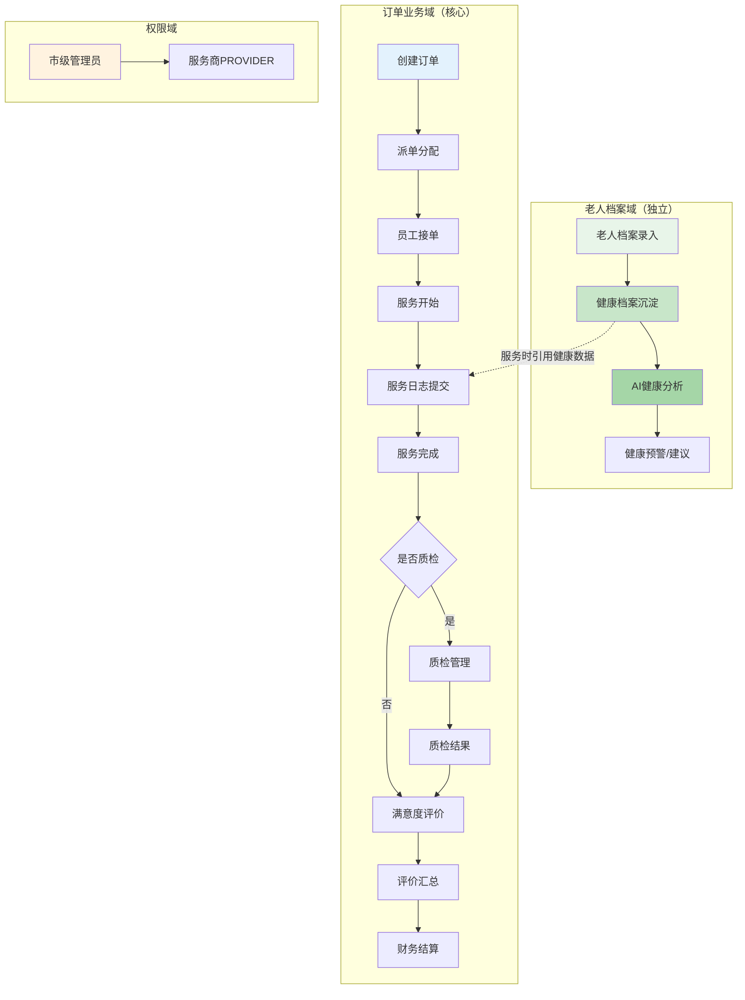
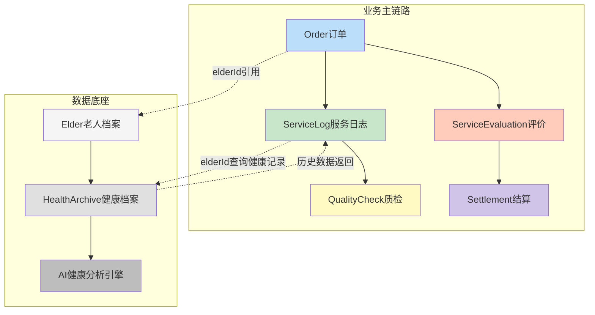
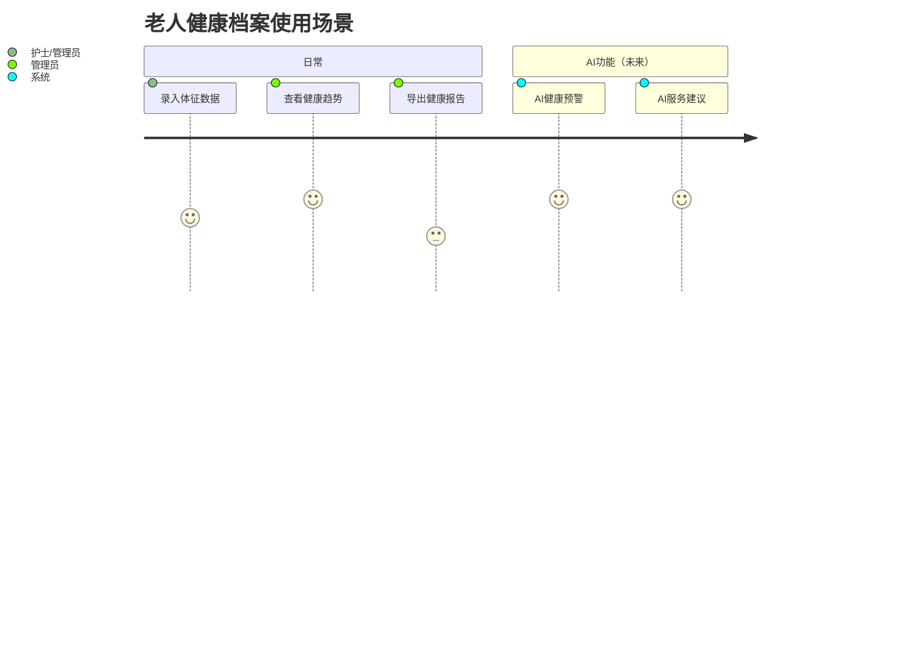

# 智慧居家养老服务管理平台 — 系统评估报告（修订版）

> 评估日期：2026-04-26  
> 修订日期：2026-04-26（根据反馈修正）  
> 评估版本：v1.1

---

## 修订说明

**重要修正**：健康档案模块（`health-archive`）定位为**独立数据底座**，不参与业务主流程，不与其他模块产生业务耦合。其核心价值在于：
- 老人健康数据的长期沉淀
- 被订单/服务日志等模块**引用**（只读）
- 将来的 AI 健康分析/预警功能的**数据入口**

因此，以下分析结论相应调整：
- 老人档案→服务记录入口问题从 P2 降为 P3
- 健康档案模块不纳入业务流程断点分析
- 健康档案的优先级调整为"长期建设"

---

## 一、执行摘要

本报告对智慧居家养老服务管理平台进行全方位系统评估。

### 核心发现

| 维度 | 评分 | 状态 |
|------|------|------|
| 业务流程完整性 | 8.0/10 | 良好，核心链路完整 |
| 数据流转完整性 | 6.5/10 | 有缺失，需修复 |
| UI美观度 | 6.0/10 | 及格，缺少行业特色 |
| 模块一致性 | 6.5/10 | 基本统一，有零散问题 |
| 用户体验 | 6.0/10 | 可用，需优化 |
| 数据架构合理性 | 8.0/10 | 健康档案定位清晰，架构解耦 |

---

## 二、业务流程分析

### 2.1 业务流程总图（修订）



**说明**：健康档案模块独立建设，将来通过 API 被服务日志等模块引用（老人历史健康状况），不参与订单状态机流转。

### 2.2 老人档案管理流程（修订）

**流程**：档案录入 → 健康档案沉淀 → AI分析

- ✅ 档案录入：基本信息、健康信息、护理等级
- ✅ 健康档案：独立页面，支持血压血糖记录、用药记录
- ⭐ 健康档案定位为数据底座，非业务链路节点
- ⚠️ 评价功能通过订单触发，非老人直接发起

### 2.3 订单全生命周期

状态机：
```
CREATED → DISPATCHED → RECEIVED → SERVICE_STARTED → SERVICE_COMPLETED
                                                        ↓
                                                    EVALUATED
                                                        ↓
                                                     SETTLED
    ↑
CANCELLED ← (任意环节可取消)
```

| 环节 | 数据完整性 | 备注 |
|------|-----------|------|
| 创建→派单→接单→开始→完成 | ✅ | 完整 |
| 服务日志 | ✅ | 含签名、照片 |
| 质检 | ✅ | 独立链路 |
| 评价 | ✅ | 支持微信链接 |
| 结算 | ⚠️ | 仅有列表，结算流程缺失 |
| 健康档案引用 | ⭐ | 将来通过API引用老人历史数据 |

### 2.4 服务质量管理闭环

```
服务日志 → 质检 → 评价 → 统计分析
                              ↓
                        改进措施（缺失）
```

前三环完整，统计分析仅展示，第四环"改进闭环"缺失。

---

## 三、数据流转完整性

### 3.1 数据架构（修订）



**关键设计**：健康档案是只读数据源，不写回业务链路。

### 3.2 ProviderId 隔离覆盖检查

| Mapper | SQL | providerId过滤 | 状态 |
|--------|-----|----------------|------|
| OrderMapper | selectOrderPage | ✅ 有 | 正常 |
| ServiceLogMapper | selectServiceLogPage | ✅ 有 | 正常 |
| QualityCheckMapper | selectQualityCheckPage | ✅ 有 | 正常 |
| EvaluationMapper | selectEvaluationPage | ✅ 有 | 正常 |
| SettlementMapper | selectSettlementPage | ✅ 有 | 正常 |
| StatisticsMapper | selectOrderTrendByDateRange | ❌ **缺失** | **P1** |
| StatisticsMapper | selectOrderStatisticsByDateRange | ❌ **缺失** | **P1** |
| StatisticsMapper | selectOrderServiceTypeDistribution | ✅ 有 | 正常 |
| StatisticsMapper | selectFinancialSummary | ✅ 有 | 正常 |
| StatisticsMapper | selectOrderSummary | ✅ 有 | 正常 |

### 3.3 其他数据问题

| 问题 | 严重度 | 文件 |
|------|--------|------|
| selectOrderStatisticsByDateRange AVG(rating)字段不存在 | P1 | StatisticsMapper.xml |
| selectEvaluationDetail 未过滤 deleted=0 | P1 | ServiceEvaluationMapper.xml |
| ServiceLogMapper 表名不规范 | P1 | ServiceLogMapper.xml |
| QualityCheckMapper 表名不规范 | P1 | QualityCheckMapper.xml |

---

## 四、UI美观度评估

详见 4.1 页面评分表（不变）。

### 4.1 页面截图评分

| # | 页面 | 路由 | 评分 | 主要问题 |
|---|------|------|------|---------|
| 01 | 登录页 | /login | 6.5 | 布局简洁但缺少养老行业温暖感 |
| 02 | 首页驾驶舱 | /dashboard | 5.5 | 数据拥挤、图表颜色偏冷 |
| 03 | 老人档案 | /business/elder | 6.0 | PersonCard 基本规范，筛选区布局合理 |
| 04 | 订单管理 | /business/order | 6.5 | 表格清晰，状态标签色彩统一 |
| 05 | 服务日志 | /business/service-log | 6.0 | 照片上传区明显，但详情抽屉信息过载 |
| 06 | 质检管理 | /business/quality | 6.5 | 表格整洁，状态色彩语义清晰 |
| 07 | 评价管理 | /business/evaluation | 7.0 | 评分展示直观，是最成熟的页面 |
| 08 | 财务结算 | /business/settlement | 5.0 | 功能严重缺失，仅有列表 |
| 09 | 健康档案 | /business/health-archive | 6.5 | 数据展示清晰，图表较多 |

**平均分：6.2/10**（含健康档案后略有提升）

### 4.2 健康档案模块评估

**现状**：
- ✅ 独立数据模块，架构清晰
- ✅ 支持血压血糖、用药记录、体征数据
- ✅ 有图表展示
- ⚠️ 目前为静态数据展示，无 AI 功能
- ⚠️ 无被服务日志引用（只读 API 未实现）

**未来定位（AI 入口）**：
- 老人健康趋势分析
- 异常指标预警
- 用药提醒生成
- 个性化服务建议

---

## 五、模块一致性检查

（与原报告一致）

| 检查项 | 状态 | 详情 |
|--------|------|------|
| 侧边栏菜单统一 | ✅ | 所有页面侧边栏一致 |
| 面包屑导航 | ✅ | 基本准确 |
| 表格组件统一 | ✅ | 全部使用 NDataTable |
| 操作按钮位置 | ✅ | 统一在右侧 |
| 删除确认框 | ✅ | 统一使用 NPopconfirm |
| 新增按钮文案 | ❌ | 混用"新增""新建""添加" |
| 表单必填标记 | ❌ | 部分页面缺失星号 |

---

## 六、用户体验评估

（与原报告一致，补充健康档案定位）

### 6.1 健康档案用户旅程



### 6.2 各角色评估（修订）

| 角色 | 当前状态 | 改进方向 |
|------|---------|---------|
| 市级管理员 | 能查全市概况 | 行政区划下钻、地图可视化 |
| 服务商管理员 | 能派单、查评价 | 结算功能、订单日历 |
| 服务人员 | 只能在订单列表筛选 | 独立工作台、APP |
| 老人/家属 | 微信评价链接 | 家属查询入口 |
| AI系统（未来） | 无入口 | **健康档案是核心数据源** |

---

## 七、P1 问题清单（立即修复）

| # | 问题 | 文件 | 行号 |
|---|------|------|------|
| P1-1 | selectOrderTrendByDateRange 无 providerId 过滤 | StatisticsMapper.xml | 5-37 |
| P1-2 | selectOrderStatisticsByDateRange 无 providerId 过滤 | StatisticsMapper.xml | 40-61 |
| P1-3 | AVG(rating) 字段不存在，应为 AVG(e.overall_score) | StatisticsMapper.xml | 47 |
| P1-4 | selectEvaluationDetail 未过滤 deleted=0 | ServiceEvaluationMapper.xml | 123 |
| P1-5 | ServiceLogMapper FROM service_log 非 t_service_log | ServiceLogMapper.xml | 48 |
| P1-6 | QualityCheckMapper FROM quality_check 非 t_quality_check | QualityCheckMapper.xml | 39 |

---

## 八、改进路线图（修订）

### 修订说明

- P2-8（老人档案→服务记录入口）降为 P3（健康档案独立定位）
- 结算模块仍是 P2 核心项
- 健康档案定位为"数据底座建设"，纳入长期规划

---

*报告生成/修订时间：2026-04-26*
